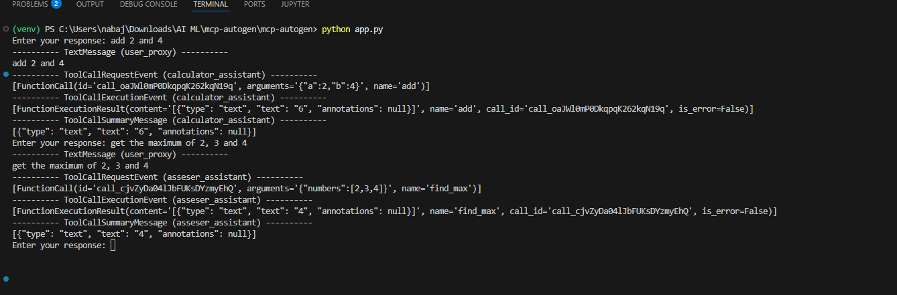
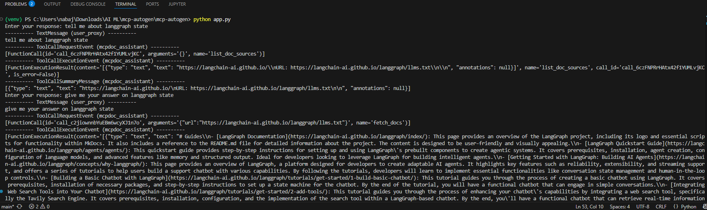
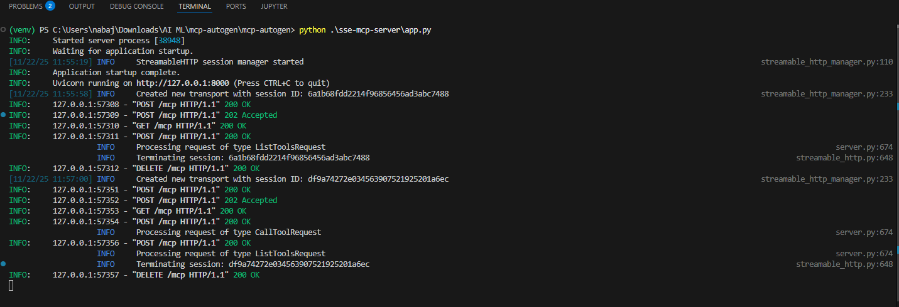

# MCP with Autogen 🎯

This is a very basic implementation of an multi-agent system that connects an Autogen LLM client to one or more MCP (Model Context Protocol) tool servers. You can use it as blueprint for making your MCP workflow from scratch. 🚀

## Features ✨
- Connect to streamable HTTP/SSE MCP servers to discover and call tools. 🌐
- Launch stdio-based MCP adapters or local stdio MCP servers as subprocesses. 🧰
- Use multiple Assistant agents (calculator, mcpdoc, asseser) and a UserProxy agent. 🤖👤
- Terminate conversations by mentioning a configured token (default: `TERMINATION`). 🛑
- Stream interactions to the console. 🖥️

## Prerequisites ✅
- Python 3.11+ 🐍
- A valid OpenAI API key (or compatible LLM client credentials) 🔑
- Project dependencies (see requirements) 📦
- Any MCP adapter binaries/scripts you plan to use (e.g., `uvx`, local stdio MCP server) 📂

## Setup ⚙️

1. Clone the repository and change into the project directory:
   - git clone <repo-url>
   - cd mcp-autogen

2. Check if you have the mcpdoc directory inside the repo. In case you don't, clone the langchain-ai mcpdoc repo.
   - `https://github.com/langchain-ai/mcpdoc`

3. Create and activate a virtual environment:
   - python -m venv .venv
   - On Windows: .venv\Scripts\activate
   - On macOS/Linux: source .venv/bin/activate

4. Install dependencies:
   - pip install -r requirements.txt 🧩

5. Configure environment variables (create a `.env` file or export):
   - OPENAI_API_KEY=your_api_key
   - OPENAI_MODEL=gpt-4  # or another compatible model

6. Ensure MCP adapter executables are available:
   - Update paths in `app.py` for `uvx_path` or the stdio server command (e.g., `"python", ["stdio-mcp-server/app.py"]`) 🔧

## Running ▶️

- Run the HTTP MCP Server:
   - python .\http-mcp-server\app.py

- Run the main async application:
  - python app.py

- Example configuration points in `app.py`:
  - HTTP/SSE MCP server URL: `http://127.0.0.1:8000/mcp`
  - Stdio MCP adapter args (mcpdoc example) and `uvx_path`
  - Local stdio MCP server command: `python stdio-mcp-server/app.py`

- Try asking questions to the agent ranging from calculations to finding min max of numbers to knowing about different modules of langgraph. You will see the workflow of the LLM tool calls on different MCP servers. Adding some snippets of such conversations here. 

When running, the Console UI streams the team chat. The UserProxy agent can prompt for interactive input via the console. The process stops when the termination token (e.g., `TERMINATION`) is mentioned.

Console logs of the locally hosted MCP server on HTTP transport.

## Customization 🛠️
- Add/remove agents or swap toolsets by editing `app.py`. 
- Experiment with different MCP servers or real-world adapters. 🌍
- Change termination token by modifying the `TextMentionTermination` parameter. 
- Swap LLMs by updating `OPENAI_MODEL` and the LLM client configuration. 

## Troubleshooting 🩺
- If an MCP subprocess fails to start, verify the command/path and permissions. 
- Ensure network access to HTTP MCP servers and correct URL/port. 
- Check environment variables and that dependencies are installed. 

